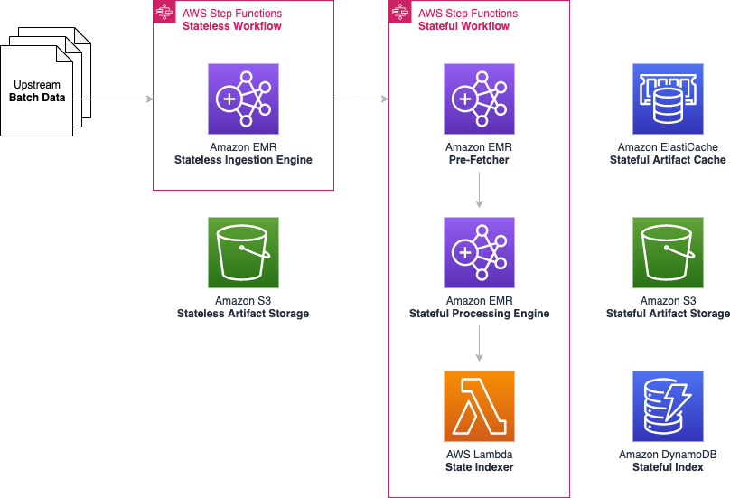

## Moving from Transactional to Stateful Batch Processing Using Amazon EMR, AWS Step Functions, and AWS Lambda
This example package contains code to ingest a batch input, transform it into stateless artifacts, and join it with existing artifacts to produce a new stateful artifact.

**Blog Post**: https://aws.amazon.com/blogs/big-data/doing-more-with-less-moving-from-transactional-to-stateful-batch-processing/



### Deployment Instructions

Build and deploy the AWS serverless application using the `sam` CLI ([installation instructions](https://docs.aws.amazon.com/serverless-application-model/latest/developerguide/serverless-sam-cli-install.html)) (this takes approximately 10-15 min the first time - this will create three EMR clusters and one Redis cache):
```
sam build
sam deploy --guided --capabilities CAPABILITY_NAMED_IAM

You will be asked to enter a few pieces of information. You may keep everything as the default, except use these values for the following prompts:
	AWS Region [us-east-1]: us-west-2
```

Uploaded an example input file to the S3 bucket:
```
aws s3 cp example-input.csv s3://development-<replace with AWS account number>/example-input.csv
```

Prepare and upload the SuperJar that will be used with the Amazon EMR cluster:
```
cd emr/
mvn clean package
aws s3 cp target/StatelessStateful-jar-with-dependencies.jar s3://development-<replace with AWS account number>/StatelessStateful-jar-with-dependencies.jar
cd ..
```

Run the `stateless-workflow` AWS Step Function on the AWS Console with the following input to produce the stateless artifacts (note that the stateless artifacts bucket was created by the AWS CloudFormation template):
```
{
  "statelessInput": "s3://development-<replace with AWS account number>/example-input.csv",
  "statelessOutput": "s3://stateless-artifacts-<replace with AWS account number>/stateless-output-1.csv"
}
```

Run the `stateful-workflow` AWS Step Function on the AWS Console with the following input to produce the stateful artifacts (note that the stateless artifacts bucket was created by the AWS CloudFormation template):
```
{
    "statelessOutput": "s3://stateless-artifacts-<replace with AWS account number>/stateless-output-1.csv",
    "prefetcherOutput": "s3://stateful-artifacts-<replace with AWS account number>/prefetcher-output-1.csv",
    "statefulOutput": "s3://stateful-artifacts-<replace with AWS account number>/stateful-output-1.csv"
}
```

Delete the AWS serverless application by running:
```
sam delete --region us-west-2
```
